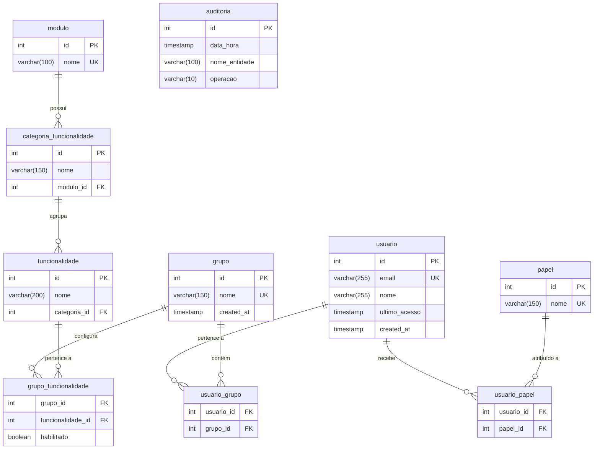

# DATABASE.md — SISSA Platform: Access Control Module

## 1. Introduction

The SISSA platform database is a PostgreSQL schema designed to manage user access control for a web-based platform. It implements users, permission groups, role assignments, and a full audit trail. All foreign keys use `ON DELETE RESTRICT` — no cascades exist anywhere, enforcing data integrity at the database level.

---

## 2. Entity-Relationship Diagram (Mermaid)



---

## 3. DDL Reference

Full DDL is in `sql/01_ddl.sql`. Run files in order:
```
psql -U postgres -d sissa -f sql/01_ddl.sql
psql -U postgres -d sissa -f sql/02_functions_a1.sql
psql -U postgres -d sissa -f sql/03_triggers_views_a2.sql
```

---

## 4. Data Dictionary

### `modulo`
Top-level platform modules visible in the group permissions screen.

| Column | Type | Constraints | Description |
|--------|------|-------------|-------------|
| id | SERIAL | PK | Auto-generated identifier |
| nome | VARCHAR(100) | NOT NULL, UNIQUE | Module name (e.g. EDITAIS, CONTRATOS) |

Seed values: `EDITAIS`, `CONTRATOS`

---

### `categoria_funcionalidade`
Named sub-groups of features within each module.

| Column | Type | Constraints | Description |
|--------|------|-------------|-------------|
| id | SERIAL | PK | Auto-generated identifier |
| nome | VARCHAR(150) | NOT NULL | Category name (e.g. "Seleção de editais") |
| modulo_id | INTEGER | FK→modulo, RESTRICT | Parent module |

---

### `funcionalidade`
Atomic, toggleable permissions shown as ON/OFF switches in the group form.

| Column | Type | Constraints | Description |
|--------|------|-------------|-------------|
| id | SERIAL | PK | Auto-generated identifier |
| nome | VARCHAR(200) | NOT NULL | Permission name (e.g. "Visualizar editais") |
| categoria_id | INTEGER | FK→categoria_funcionalidade, RESTRICT | Parent category |

Seed values (13 total): Visualizar editais, Gerenciar anexos do edital, Gerenciar status, Adicionar edital manualmente, Gerenciar grupos de editais, Gerenciar análise de edital, Visualizar histórico de análise de edital, Realizar pré-análise técnica, Realizar análise de edital, Gerenciar etapas do edital, Realizar proposta, Gerenciar histórico de análise de edital, Gerenciar consulta.

---

### `usuario`
Platform users. No password stored — authentication is via Microsoft Active Directory (AD). `nome` is null until populated by the platform on first AD login.

| Column | Type | Constraints | Description |
|--------|------|-------------|-------------|
| id | SERIAL | PK | Auto-generated identifier |
| email | VARCHAR(255) | NOT NULL, UNIQUE | Corporate email (AD identity) |
| nome | VARCHAR(255) | nullable | Populated by AD on first login |
| ultimo_acesso | TIMESTAMP | nullable | NULL = never accessed |
| created_at | TIMESTAMP | NOT NULL, DEFAULT NOW() | Registration timestamp |

---

### `grupo`
Permission groups. A user linked to a group inherits all enabled permissions of that group.

| Column | Type | Constraints | Description |
|--------|------|-------------|-------------|
| id | SERIAL | PK | Auto-generated identifier |
| nome | VARCHAR(150) | NOT NULL, UNIQUE | Group name (e.g. "Administrador") |
| created_at | TIMESTAMP | NOT NULL, DEFAULT NOW() | Creation timestamp |

---

### `papel`
Descriptive organizational roles (e.g. "Analista de proposta"). Labels only — they do not affect permission checks, only user classification.

| Column | Type | Constraints | Description |
|--------|------|-------------|-------------|
| id | SERIAL | PK | Auto-generated identifier |
| nome | VARCHAR(150) | NOT NULL, UNIQUE | Role label |

---

### `usuario_grupo`
Many-to-many link between users and groups. **No cascade delete** — rows must be removed explicitly before a user or group is deleted (handled by trigger `tg_acionar_remocao_dependencia`).

| Column | Type | Constraints | Description |
|--------|------|-------------|-------------|
| usuario_id | INTEGER | PK, FK→usuario RESTRICT | User reference |
| grupo_id | INTEGER | PK, FK→grupo RESTRICT | Group reference |

---

### `usuario_papel`
Many-to-many link between users and roles. **No cascade delete**.

| Column | Type | Constraints | Description |
|--------|------|-------------|-------------|
| usuario_id | INTEGER | PK, FK→usuario RESTRICT | User reference |
| papel_id | INTEGER | PK, FK→papel RESTRICT | Role reference |

---

### `grupo_funcionalidade`
Associates every functionality with a group and stores whether it is enabled (`habilitado = TRUE`) or disabled for users of that group. **No cascade delete**.

| Column | Type | Constraints | Description |
|--------|------|-------------|-------------|
| grupo_id | INTEGER | PK, FK→grupo RESTRICT | Group reference |
| funcionalidade_id | INTEGER | PK, FK→funcionalidade RESTRICT | Feature reference |
| habilitado | BOOLEAN | NOT NULL, DEFAULT FALSE | Whether this feature is active for the group |

---

### `auditoria`
Append-only audit trail written by database triggers. Records every INSERT, UPDATE, and DELETE across all platform tables (except itself).

| Column | Type | Constraints | Description |
|--------|------|-------------|-------------|
| id | SERIAL | PK | Auto-generated identifier |
| data_hora | TIMESTAMP | NOT NULL, DEFAULT NOW() | When the action occurred |
| nome_entidade | VARCHAR(100) | NOT NULL | Name of the affected table |
| operacao | VARCHAR(10) | CHECK IN ('INSERT','UPDATE','DELETE') | Type of operation |

---

## 5. Activity 1 — Functions & Procedures Summary

| Object | Type | Description |
|--------|------|-------------|
| `fu_validar_cadastro(email)` | FUNCTION → BOOLEAN | Returns TRUE if email exists in `usuario` |
| `fu_validar_email(email)` | FUNCTION → BOOLEAN | Returns TRUE if email matches RFC regex |
| `fu_formatar_tempo_acesso(timestamp)` | FUNCTION → VARCHAR | Returns human-readable elapsed time in Portuguese |
| `pr_excluir_usuario(id)` | FUNCTION → BOOLEAN | Deletes user if not admin; returns success flag |
| `fu_migrar_usuarios_grupo(origem, destino)` | FUNCTION → TABLE | Moves users from one group to another; returns migrated list |
| `pr_copiar_grupo(origem, novo)` | FUNCTION → INTEGER | Copies group + permissions; returns enabled perm count |
| `fu_verificar_engajamento()` | FUNCTION → TABLE | Classifies all users by engagement level |
| `pr_criar_usuario_adm(email, grupo)` | FUNCTION → VOID | Creates admin user + group with all permissions |

---

## 6. Activity 2 — Triggers & Views Summary

| Object | Type | Description |
|--------|------|-------------|
| `pr_remover_dependencia_usuario(id)` | FUNCTION → VOID | Removes `usuario_papel` + `usuario_grupo` rows for a user |
| `tg_acionar_remocao_dependencia` | TRIGGER (BEFORE DELETE / usuario) | Calls `pr_remover_dependencia_usuario` before user deletion |
| `tg_fn_auditoria` + 9 triggers | TRIGGER (AFTER I/U/D / all tables) | Logs every operation to `auditoria` |
| `vw_consulta_usuario` | VIEW | User list with groups, roles, formatted last access |
| `vwm_consulta_usuario` | MATERIALIZED VIEW | Cached version of `vw_consulta_usuario` |
| `vw_consulta_grupo` | VIEW | Group list with permission + user counts |
| `vmw_consulta_grupo` | MATERIALIZED VIEW | Cached version of `vw_consulta_grupo` |
| `vw_consulta_permissoes_grupo` | VIEW | All functionalities per group with enabled/disabled state |
| `vmw_consulta_permissoes_grupo` | MATERIALIZED VIEW | Cached version of `vw_consulta_permissoes_grupo` |

### Materialized View Refresh Strategies (item 12)

**Alternative 1 — pg_cron** (runs inside PostgreSQL, no external dependency):
```sql
SELECT cron.schedule('refresh-mat-views', '0 */2 * * *', $$
    REFRESH MATERIALIZED VIEW CONCURRENTLY vwm_consulta_usuario;
    REFRESH MATERIALIZED VIEW CONCURRENTLY vmw_consulta_grupo;
    REFRESH MATERIALIZED VIEW CONCURRENTLY vmw_consulta_permissoes_grupo;
$$);
```

**Alternative 2 — OS crontab** (no extension required):
```bash
# crontab -e
0 */2 * * * psql -U postgres -d sissa -c "
  REFRESH MATERIALIZED VIEW CONCURRENTLY vwm_consulta_usuario;
  REFRESH MATERIALIZED VIEW CONCURRENTLY vmw_consulta_grupo;
  REFRESH MATERIALIZED VIEW CONCURRENTLY vmw_consulta_permissoes_grupo;
"
```
