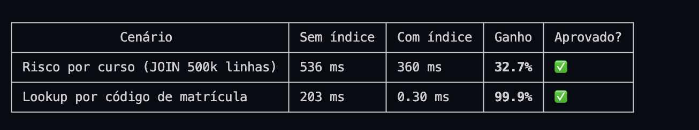

# Guia de Apresentação — SISSA (as entregas no banco)

Este guia mostra **cada uma das 6 entregas SQL rodando direto no PostgreSQL**, em
paralelo com o que aparece no frontend — a ideia é, na banca, dar `SELECT`/`CALL`
e mostrar que a tela apenas reflete o que o banco já faz.

> Para o roteiro de navegação **na tela** (logins, telas, cliques), use o
> `GUIA_DEMONSTRACAO.md`. Aqui o foco é o **banco**.

## Como subir
```bash
dropdb --if-exists sissa && createdb sissa
psql -d sissa -f sql/01_ddl.sql
psql -d sissa -f sql/05_sissa_domain.sql
psql -d sissa -f sql/06_roster_universidade.sql
cd backend && node server.js          # http://localhost:3000
```

## Como acompanhar
Deixe **dois terminais/janelas** abertos lado a lado:
- o **navegador** em `http://localhost:3000` (o frontend);
- um **psql** conectado ao banco, para rodar os comandos deste guia:
```bash
psql -d sissa
```
Assim você roda o SQL e mostra o reflexo na tela (e vice-versa).

---

## Visão geral do cadastro
O seed é **multi-instituição de verdade**: 4 instituições, sendo só UFG e IFSP com
dados de piloto (IFRO/IFMT existem para provar que o modelo não é mono-instituição).

**Instituições e unidades**
```sql
SELECT i.sigla, i.nome, un.sigla AS unidade, un.nome
FROM sissa_instituicao i
LEFT JOIN sissa_unidade un ON un.instituicao_id = i.id
ORDER BY i.id, un.id;
```
- **UFG** → Regional Goiânia (GYN) · **IFSP** → Câmpus São Paulo (SPO) + Guarulhos (GRU)
- **IFRO** → Colorado do Oeste (COL) · **IFMT** → Cuiabá (CBA)

**Cursos (6) — instituição, semestres e nº de alunos**
```sql
SELECT i.sigla, c.nome, c.codigo, c.quantidade_semestres AS semestres,
       COUNT(m.id) AS alunos
FROM sissa_curso c
JOIN sissa_unidade un      ON un.id = c.unidade_id
JOIN sissa_instituicao i   ON i.id = un.instituicao_id
LEFT JOIN sissa_matricula m ON m.curso_id = c.id
GROUP BY i.sigla, c.nome, c.codigo, c.quantidade_semestres, c.id
ORDER BY i.sigla, c.id;
```
| Curso | Código | Inst. | Sem. | Alunos |
|-------|:------:|:----:|:---:|:-----:|
| Licenciatura em Física | LFI | UFG | 8 | 12 |
| Licenciatura em Matemática | LMA | UFG | 8 | 6 |
| Bacharelado em Agronomia | 52921 | UFG | 10 | 0 |
| Tecnologia em ADS | ADS | IFSP | 6 | 10 |
| Téc. Agroecologia | 12075 | IFRO | 6 | 0 |
| Téc. Administração | 50 | IFRO | 4 | 0 |

**Semestres (6)** — guardados como `ano` + `periodo`:
```sql
SELECT ano || '/' || periodo AS semestre FROM sissa_semestre ORDER BY id;
-- 2023/1, 2023/2, 2024/1, 2024/2, 2025/1, 2025/2
```

**Alunos e risco (28 no total)** — o nível é calculado, não digitado:
```sql
SELECT c.nome AS curso, r.risco, COUNT(*)
FROM sissa_matricula m
JOIN sissa_curso c          ON c.id = m.curso_id
JOIN sissa_risco_evasao r   ON r.matricula_id = m.id
GROUP BY c.nome, r.risco ORDER BY c.nome, r.risco;
-- Física 4/4/4 · Matemática 2/2/2 · ADS 3/3/4 (Alto/Médio/Baixo)
```

**Disciplinas, turmas e inscrições** (o nº de turmas de um aluno é **derivado**):
```sql
SELECT (SELECT COUNT(*) FROM sissa_disciplina)      AS disciplinas,
       (SELECT COUNT(*) FROM sissa_turma)           AS turmas,
       (SELECT COUNT(*) FROM sissa_professor)       AS professores,
       (SELECT COUNT(*) FROM sissa_inscricao_turma) AS inscricoes;
-- 11 · 11 · 4 · 88
```

**Grupos de intervenção (3) e intervenções (6)** — todos de Física:
```sql
SELECT g.titulo, g.status,
       (SELECT COUNT(*) FROM sissa_grupo_matricula gm WHERE gm.grupo_id = g.id) AS membros
FROM sissa_grupo_intervencao g ORDER BY g.id;
-- Grupo A=Ativo(4) · Grupo B=Inativo(4) · Grupo C=Inativo(5)
```

---

## As 6 entregas

### 1. Funções (Requisito 1)
**Na tela:** a coluna **Risco** (Alto/Médio/Baixo) na lista de Estudantes e o **gauge** de risco do curso.

**1ª função — `fu_sissa_calcular_risco(matricula_id)`** classifica o risco de uma
matrícula a partir dos indicadores acadêmicos. Definição (`sql/05_sissa_domain.sql:459-480`):
```sql
CREATE OR REPLACE FUNCTION fu_sissa_calcular_risco(p_matricula_id INTEGER)
RETURNS VARCHAR
LANGUAGE plpgsql
AS $$
DECLARE
    v_rep   INTEGER;
    v_media NUMERIC;
    v_ch    INTEGER;
BEGIN
    SELECT reprovacoes, media_global, ch_semestre
    INTO   v_rep, v_media, v_ch
    FROM   sissa_matricula
    WHERE  id = p_matricula_id;

    IF NOT FOUND THEN
        RETURN 'Sem dados';
    END IF;

    -- delega à fonte única dos limiares
    RETURN fu_sissa_classificar(v_rep, v_media, v_ch);
END;
$$;
```
Os limiares ficam em **`fu_sissa_classificar(reprovacoes, media, ch)`** (fonte única,
`IMMUTABLE`) — a função acima e a trigger de classificação **delegam** a ela, então a regra
de risco mora num lugar só. Definição (`sql/05_sissa_domain.sql:344-362`):
```sql
CREATE OR REPLACE FUNCTION fu_sissa_classificar(
    p_reprovacoes  INTEGER,
    p_media_global NUMERIC,
    p_ch_semestre  INTEGER
)
RETURNS TEXT
LANGUAGE plpgsql
IMMUTABLE
AS $$
BEGIN
    IF p_reprovacoes >= 3 OR p_media_global < 3.0 THEN
        RETURN 'Alto';
    ELSIF p_reprovacoes >= 1 OR p_media_global < 5.5 OR p_ch_semestre < 400 THEN
        RETURN 'Médio';
    ELSE
        RETURN 'Baixo';
    END IF;
END;
$$;
```
**Como demonstrar** — o risco de cada matrícula sai da função, não de um campo digitado:
```sql
SELECT m.codigo AS matricula, a.nome, m.reprovacoes, m.media_global,
       fu_sissa_calcular_risco(m.id) AS risco
FROM sissa_matricula m JOIN sissa_aluno a ON a.id = m.aluno_id
WHERE m.curso_id = 1 ORDER BY m.id LIMIT 3;
```

**2ª função — `fu_sissa_dias_sem_intervencao(grupo_id)`** mede o "abandono" de um grupo
(dias desde a última intervenção dos membros, ou desde a criação).
Definição (`sql/05_sissa_domain.sql:595-621`):
```sql
CREATE OR REPLACE FUNCTION fu_sissa_dias_sem_intervencao(p_grupo_id INTEGER)
RETURNS INTEGER
LANGUAGE plpgsql
AS $$
DECLARE
    v_criado DATE;
    v_ultima DATE;
BEGIN
    SELECT created_at::DATE
    INTO   v_criado
    FROM   sissa_grupo_intervencao
    WHERE  id = p_grupo_id;

    IF NOT FOUND THEN
        RETURN NULL;                       -- grupo inexistente
    END IF;

    SELECT MAX(i.data_intervencao)
    INTO   v_ultima
    FROM   sissa_intervencao i
    JOIN   sissa_grupo_matricula gm ON gm.matricula_id = i.matricula_id
    WHERE  gm.grupo_id = p_grupo_id;

    -- sem intervenção (v_ultima IS NULL) → mede desde a criação do grupo
    RETURN NOW()::DATE - COALESCE(v_ultima, v_criado);
END;
$$;
```
**Como demonstrar:**
```sql
SELECT g.titulo, g.status, fu_sissa_dias_sem_intervencao(g.id) AS dias_sem_intervencao
FROM sissa_grupo_intervencao g ORDER BY g.id;
-- Grupo A ~625 · B ~640 · C ~587  (os dias crescem com o tempo)
```
**O que observar:** todos passam de **180** → é exatamente o limiar que a procedure de
manutenção usa (próxima seção). A regra de abandono é **uma função só**, reusada pela procedure.

**Função de apoio — `fu_sissa_resumo_curso(curso_id)`** alimenta o gauge.
Definição (`sql/05_sissa_domain.sql:488-521`):
```sql
CREATE OR REPLACE FUNCTION fu_sissa_resumo_curso(p_curso_id INTEGER)
RETURNS TABLE(
    r_curso_nome       VARCHAR,
    r_total            BIGINT,
    r_alto             BIGINT,
    r_medio            BIGINT,
    r_baixo            BIGINT,
    r_media_reprov     NUMERIC,
    r_pct_alto_risco   NUMERIC
)
LANGUAGE plpgsql
AS $$
BEGIN
    RETURN QUERY
    SELECT
        c.nome::VARCHAR                                      AS r_curso_nome,
        COUNT(m.id)                                          AS r_total,
        COUNT(*) FILTER (WHERE r.risco = 'Alto')            AS r_alto,
        COUNT(*) FILTER (WHERE r.risco = 'Médio')           AS r_medio,
        COUNT(*) FILTER (WHERE r.risco = 'Baixo')           AS r_baixo,
        ROUND(AVG(m.reprovacoes)::NUMERIC, 2)               AS r_media_reprov,
        CASE
            WHEN COUNT(m.id) = 0 THEN 0
            ELSE ROUND(
                (COUNT(*) FILTER (WHERE r.risco = 'Alto') * 100.0 / COUNT(m.id))::NUMERIC, 1
            )
        END                                                  AS r_pct_alto_risco
    FROM sissa_curso c
    JOIN sissa_matricula m         ON m.curso_id = c.id
    LEFT JOIN sissa_risco_evasao r ON r.matricula_id = m.id
    WHERE c.id = p_curso_id
    GROUP BY c.nome;
END;
$$;
```
**Como demonstrar:**
```sql
SELECT * FROM fu_sissa_resumo_curso(1);
-- total=12, alto=4, medio=4, baixo=4, pct_alto_risco=33.3
```

### 2. Procedimentos (Requisito 2)
São **`CREATE PROCEDURE`** reais (invocadas com `CALL`; retorno por `INOUT`).
⚠️ **Estas escrevem no banco** — rode de verdade para ver o efeito na tela e
**reconstrua o banco no final** (seção "Restaurar o estado").

**`pr_sissa_criar_intervencao_grupo(...)`** — o botão *"intervenção a partir do grupo"*.
Cria **uma intervenção individual por matrícula** do grupo (sem N:N) e grava o autor.
Definição (`sql/05_sissa_domain.sql:633-671`):
```sql
CREATE OR REPLACE PROCEDURE pr_sissa_criar_intervencao_grupo(
    p_grupo_id       INTEGER,
    p_data           DATE,
    p_semestre_id    INTEGER,
    p_disciplina_id  INTEGER,
    p_forma_meio     VARCHAR,
    p_assunto        VARCHAR,
    p_interacao      VARCHAR,
    p_tipo           VARCHAR,
    p_acompanhamento VARCHAR,
    p_observacoes    TEXT,
    p_autoria_id     INTEGER DEFAULT NULL,
    INOUT p_total    INTEGER DEFAULT 0
)
LANGUAGE plpgsql
AS $$
DECLARE
    v_matricula_id INTEGER;
BEGIN
    IF NOT EXISTS (SELECT 1 FROM sissa_grupo_intervencao WHERE id = p_grupo_id) THEN
        RAISE EXCEPTION 'Grupo de intervenção % não encontrado.', p_grupo_id;
    END IF;

    p_total := 0;
    FOR v_matricula_id IN
        SELECT matricula_id FROM sissa_grupo_matricula WHERE grupo_id = p_grupo_id
    LOOP
        -- Grava o autor (p_autoria_id) em cada intervenção, alinhando com o
        -- fluxo direto POST /intervencoes (permite o Tutor editar só as suas).
        INSERT INTO sissa_intervencao
            (matricula_id, disciplina_id, semestre_id, data_intervencao,
             forma_meio, assunto, formato, interacao, tipo, acompanhamento, observacoes, autoria_id)
        VALUES
            (v_matricula_id, p_disciplina_id, p_semestre_id, p_data,
             p_forma_meio, p_assunto, 'Individual', p_interacao, p_tipo, p_acompanhamento, p_observacoes, p_autoria_id);
        p_total := p_total + 1;
    END LOOP;
END;
$$;
```
**Como demonstrar:**
```sql
CALL pr_sissa_criar_intervencao_grupo(
  1, CURRENT_DATE, 5, 1, 'Chat', 'Apoio', 'Pró-ativa',
  'Conteúdo', 'Síncrono', 'demo apresentação', 1, 0);   -- grupo 1, autoria 1 (Adailton)
-- p_total = 4  (Grupo A tem 4 membros → 4 intervenções)
SELECT matricula_id, formato, autoria_id FROM sissa_intervencao
WHERE observacoes = 'demo apresentação';
```
**Na tela:** as 4 intervenções aparecem na lista de Intervenções, uma por aluno.

**`pr_sissa_atualizar_status_grupos(INOUT total)`** — o botão *"Manutenção"*.
Inativa grupos parados há mais de 180 dias (a medição é **delegada** a
`fu_sissa_dias_sem_intervencao`). Definição (`sql/05_sissa_domain.sql:681-703`):
```sql
CREATE OR REPLACE PROCEDURE pr_sissa_atualizar_status_grupos(
    INOUT p_total INTEGER DEFAULT 0
)
LANGUAGE plpgsql
AS $$
DECLARE
    v_rec RECORD;
BEGIN
    p_total := 0;
    FOR v_rec IN
        SELECT g.id
        FROM sissa_grupo_intervencao g
        WHERE g.status = 'Ativo'
    LOOP
        IF fu_sissa_dias_sem_intervencao(v_rec.id) > 180 THEN
            UPDATE sissa_grupo_intervencao
            SET    status = 'Inativo'
            WHERE  id = v_rec.id;
            p_total := p_total + 1;
        END IF;
    END LOOP;
END;
$$;
```
**Como demonstrar:**
```sql
CALL pr_sissa_atualizar_status_grupos(0);
-- p_total = 1
SELECT titulo, status FROM sissa_grupo_intervencao ORDER BY id;
-- Grupo A passa de Ativo → Inativo (estava com ~625 dias)
```
**O que observar:** só o **Grupo A** muda (B e C já eram Inativos). Recarregue a tela de
Grupos para ver o status mudar.

### 3. Triggers (Requisito 3) — 3 triggers

**Trigger 1 — `tg_sissa_classificar_risco`** (BEFORE INSERT/UPDATE em `sissa_risco_evasao`)
— o campo `risco` **nunca** é digitado; é derivado dos indicadores da matrícula (delega à
fonte única `fu_sissa_classificar`). Definição (`sql/05_sissa_domain.sql:395-417`):
```sql
CREATE OR REPLACE FUNCTION fn_tg_sissa_classificar_risco()
RETURNS TRIGGER
LANGUAGE plpgsql
AS $$
DECLARE
    v_rep   INTEGER;
    v_media NUMERIC;
    v_ch    INTEGER;
BEGIN
    SELECT reprovacoes, media_global, ch_semestre
    INTO   v_rep, v_media, v_ch
    FROM   sissa_matricula
    WHERE  id = NEW.matricula_id;

    NEW.risco := fu_sissa_classificar(v_rep, v_media, v_ch);
    RETURN NEW;
END;
$$;

CREATE TRIGGER tg_sissa_classificar_risco
    BEFORE INSERT OR UPDATE ON sissa_risco_evasao
    FOR EACH ROW
    EXECUTE FUNCTION fn_tg_sissa_classificar_risco();
```

**Trigger 2 — `tg_sissa_risco_evasao_timestamp`** (BEFORE INSERT/UPDATE) — carimba
`updated_at` a cada escrita (auditoria temporal). Definição (`sql/05_sissa_domain.sql:372-385`):
```sql
CREATE OR REPLACE FUNCTION fn_tg_sissa_risco_updated_at()
RETURNS TRIGGER
LANGUAGE plpgsql
AS $$
BEGIN
    NEW.updated_at := NOW();
    RETURN NEW;
END;
$$;

CREATE TRIGGER tg_sissa_risco_evasao_timestamp
    BEFORE INSERT OR UPDATE ON sissa_risco_evasao
    FOR EACH ROW
    EXECUTE FUNCTION fn_tg_sissa_risco_updated_at();
```

**Como demonstrar as duas** — mude os indicadores da matrícula e force um update no risco:
```sql
SELECT risco FROM sissa_risco_evasao WHERE matricula_id =
  (SELECT id FROM sissa_matricula WHERE codigo = '2021108020001');     -- Alto
UPDATE sissa_matricula SET reprovacoes = 0, media_global = 9.5 WHERE codigo = '2021108020001';
UPDATE sissa_risco_evasao SET maior_influencia = maior_influencia
  WHERE matricula_id = (SELECT id FROM sissa_matricula WHERE codigo = '2021108020001');
SELECT risco, updated_at FROM sissa_risco_evasao WHERE matricula_id =
  (SELECT id FROM sissa_matricula WHERE codigo = '2021108020001');     -- agora Baixo
```
**O que observar:** o `risco` recalculou para **Baixo** sozinho (Trigger 1) e o `updated_at`
**saltou para agora** sozinho (Trigger 2) — nenhum dos dois foi escrito à mão.

**Trigger 3 — `tg_sissa_grupo_inativo_auto`** (AFTER INSERT em `sissa_intervencao`) —
registrar uma intervenção para um membro de grupo **Inativo** o **reativa**.
Definição (`sql/05_sissa_domain.sql:426-447`):
```sql
CREATE OR REPLACE FUNCTION fn_tg_sissa_grupo_inativo_auto()
RETURNS TRIGGER
LANGUAGE plpgsql
AS $$
BEGIN
    UPDATE sissa_grupo_intervencao g
    SET    status = 'Ativo'
    WHERE  g.status = 'Inativo'
    AND    EXISTS (
        SELECT 1 FROM sissa_grupo_matricula gm
        WHERE  gm.grupo_id = g.id
        AND    gm.matricula_id = NEW.matricula_id
    );
    RETURN NEW;
END;
$$;

DROP TRIGGER IF EXISTS tg_sissa_grupo_inativo_auto ON sissa_intervencao;
CREATE TRIGGER tg_sissa_grupo_inativo_auto
    AFTER INSERT ON sissa_intervencao
    FOR EACH ROW
    EXECUTE FUNCTION fn_tg_sissa_grupo_inativo_auto();
```
**Como demonstrar:**
```sql
SELECT status FROM sissa_grupo_intervencao WHERE titulo = 'Grupo B';   -- Inativo
INSERT INTO sissa_intervencao (matricula_id, data_intervencao, formato)
  SELECT id, CURRENT_DATE, 'Individual' FROM sissa_matricula WHERE codigo = '2021108020002';
SELECT status FROM sissa_grupo_intervencao WHERE titulo = 'Grupo B';   -- Ativo
```
**Na tela:** é o passo "registrar intervenção para aluno de grupo inativo → grupo volta a Ativo".

### 4. Views (Requisito 4) — 5 views

**View 1 — `vw_sissa_estudantes_risco`** (a lista de Estudantes: junta
aluno+matrícula+curso+instituição+risco). Definição (`sql/05_sissa_domain.sql:710-745`):
```sql
CREATE OR REPLACE VIEW vw_sissa_estudantes_risco AS
SELECT
    m.id,
    m.codigo AS matricula,
    a.nome,
    m.ingresso,
    c.id     AS curso_id,
    c.nome   AS curso_nome,
    c.codigo AS curso_codigo,
    i.nome   AS instituicao_nome,
    i.code_mec,
    r.risco,
    r.semestre_saida,
    m.media_global,
    r.semestre_atual,
    m.reprovacoes,
    m.ch_semestre,
    r.maior_influencia,
    (
        SELECT COUNT(*)
        FROM sissa_inscricao_turma it
        WHERE it.matricula_id = m.id
    ) AS turmas,
    i.sigla  AS instituicao_sigla,
    r.updated_at AS risco_updated_at,
    (
        SELECT COUNT(*)
        FROM sissa_grupo_matricula gm
        WHERE gm.matricula_id = m.id
    ) AS total_grupos
FROM sissa_matricula m
JOIN  sissa_aluno a            ON a.id = m.aluno_id
JOIN  sissa_curso c            ON c.id = m.curso_id
JOIN  sissa_unidade un         ON un.id = c.unidade_id
JOIN  sissa_instituicao i      ON i.id = un.instituicao_id
LEFT JOIN sissa_risco_evasao r ON r.matricula_id = m.id;
```
```sql
SELECT matricula, nome, curso_nome, risco FROM vw_sissa_estudantes_risco WHERE curso_id = 1 LIMIT 5;
```

**View 2 — `vw_sissa_grupos`** (a tela de Grupos, com contagem de membros).
Definição (`sql/05_sissa_domain.sql:748-765`):
```sql
CREATE OR REPLACE VIEW vw_sissa_grupos AS
SELECT
    g.id,
    g.titulo,
    g.semestre,
    g.observacoes,
    g.status,
    g.created_at,
    u.nome     AS autoria_nome,
    u.perfil_id,
    p.nome     AS autoria_perfil,
    COUNT(gm.matricula_id) AS total_estudantes
FROM sissa_grupo_intervencao g
LEFT JOIN sissa_usuario_sissa u    ON u.id = g.autoria_id
LEFT JOIN sissa_perfil p           ON p.id = u.perfil_id
LEFT JOIN sissa_grupo_matricula gm ON gm.grupo_id = g.id
GROUP BY g.id, g.titulo, g.semestre, g.observacoes, g.status, g.created_at,
         u.nome, u.perfil_id, p.nome;
```
```sql
SELECT titulo, status, total_estudantes FROM vw_sissa_grupos ORDER BY id;
```

**View 3 — `vw_sissa_risco_anonimo`** (exatamente o que a **área pública** mostra: risco
**sem** nome nem matrícula). Definição (`sql/05_sissa_domain.sql:768-791`):
```sql
CREATE OR REPLACE VIEW vw_sissa_risco_anonimo AS
SELECT
    r.id                                        AS risco_id,
    c.nome                                      AS curso_nome,
    c.codigo                                    AS curso_codigo,
    i.nome                                      AS instituicao_nome,
    r.risco,
    r.semestre_saida,
    m.media_global,
    r.semestre_atual,
    m.reprovacoes,
    m.ch_semestre,
    r.maior_influencia,
    (
        SELECT COUNT(*)
        FROM sissa_inscricao_turma it
        WHERE it.matricula_id = m.id
    ) AS turmas,
    r.updated_at
FROM sissa_risco_evasao r
JOIN sissa_matricula m     ON m.id = r.matricula_id
JOIN sissa_curso c         ON c.id = m.curso_id
JOIN sissa_unidade un      ON un.id = c.unidade_id
JOIN sissa_instituicao i   ON i.id = un.instituicao_id;
```
```sql
SELECT risco_id, curso_nome, risco, media_global FROM vw_sissa_risco_anonimo LIMIT 5;
-- nenhuma coluna identifica o aluno (sem nome, sem matrícula)
```

**View 4 — `vw_sissa_resumo_intervencoes`** (KPIs por grupo).
Definição (`sql/05_sissa_domain.sql:794-815`):
```sql
CREATE OR REPLACE VIEW vw_sissa_resumo_intervencoes AS
SELECT
    g.id                                                             AS grupo_id,
    g.titulo                                                         AS grupo_titulo,
    g.semestre                                                       AS grupo_semestre,
    g.status                                                         AS grupo_status,
    COUNT(DISTINCT i.id)                                            AS total_intervencoes,
    COUNT(DISTINCT gm.matricula_id)                                 AS total_estudantes_grupo,
    COUNT(DISTINCT i.matricula_id)                                  AS total_estudantes_atendidos,
    COUNT(*) FILTER (WHERE i.objetivo_alcancado = 'Sim')           AS objetivos_sim,
    COUNT(*) FILTER (WHERE i.objetivo_alcancado = 'Não')           AS objetivos_nao,
    COUNT(*) FILTER (WHERE i.objetivo_alcancado = 'Parcialmente')  AS objetivos_parciais,
    MAX(i.data_intervencao)                                         AS ultima_intervencao,
    MIN(i.data_intervencao)                                         AS primeira_intervencao,
    u.nome                                                           AS autoria_nome,
    p.nome                                                           AS autoria_perfil
FROM sissa_grupo_intervencao g
LEFT JOIN sissa_grupo_matricula gm ON gm.grupo_id = g.id
LEFT JOIN sissa_intervencao i      ON i.matricula_id = gm.matricula_id
LEFT JOIN sissa_usuario_sissa u    ON u.id = g.autoria_id
LEFT JOIN sissa_perfil p           ON p.id = u.perfil_id
GROUP BY g.id, g.titulo, g.semestre, g.status, u.nome, p.nome;
```
```sql
SELECT grupo_titulo, total_intervencoes, total_estudantes_atendidos FROM vw_sissa_resumo_intervencoes;
```

**View 5 — `vw_sissa_perfil_permissoes`** (matriz nível × ação por perfil).
Definição (`sql/05_sissa_domain.sql:818-826`):
```sql
CREATE OR REPLACE VIEW vw_sissa_perfil_permissoes AS
SELECT
    p.id    AS perfil_id,
    p.nome  AS perfil_nome,
    p.nivel,
    na.acao
FROM sissa_perfil p
JOIN sissa_nivel_acao na ON na.nivel = p.nivel
ORDER BY p.nivel DESC, p.nome, na.acao;
```
```sql
SELECT perfil_nome, nivel, acao FROM vw_sissa_perfil_permissoes ORDER BY nivel DESC, acao;
```

### 5. Índices (Requisito 5)
Duas necessidades de consulta com índice: **risco por curso** e **identificação por matrícula**.
Definições (`sql/05_sissa_domain.sql`):
```sql
-- Necessidade 1 — "risco de evasão dos alunos do curso": o join filtra por curso_id
-- (matrícula) e por nível de risco. B-tree em matricula(curso_id) + índice composto
-- (risco, matricula_id) em sissa_risco_evasao.
CREATE INDEX idx_sissa_matricula_curso ON sissa_matricula(curso_id);          -- :211
CREATE INDEX idx_sissa_risco_comp      ON sissa_risco_evasao(risco, matricula_id);  -- :330

-- Necessidade 2 — "identificação do estudante por matrícula": busca 1 linha por código.
-- O UNIQUE da coluna já cria o índice B-tree (sissa_matricula, :197).
-- codigo VARCHAR(30) NOT NULL UNIQUE
```
**Como demonstrar** — listar os índices da tabela de risco:
```sql
SELECT indexname FROM pg_indexes WHERE tablename = 'sissa_risco_evasao' ORDER BY 1;
-- idx_sissa_risco_comp (risco, matricula_id), idx_sissa_risco_nivel, idx_sissa_risco_updated, ...
```
> No banco de **demonstração** (28 alunos) o planejador usa *Seq Scan* — em tão poucas
> linhas o índice não compensa. A **prova do ganho** está no benchmark com massa de dados
> (`sql/07`), que gera 500 mil linhas e mede com/sem índice:
```bash
psql -d sissa -f sql/07_sissa_indices_performance.sql       # cria a massa e a função
```
```sql
SELECT * FROM fu_sissa_benchmark_indice(500000, 25);        # reexecutar o teste
-- ganhos ≈ 84 % (curso_id, risco) e ≈ 99 % (matrícula) — bem acima dos 20 % exigidos
```
> Código-fonte: `sql/07_sissa_indices_performance.sql:58-191` (a função de benchmark, com o
> `EXPLAIN ANALYZE` com e sem índice de cada um dos 2 cenários).


### 6. Segurança — roles (Requisito 6) — 3 roles
`admin_sissa` (CRUD), `leitura_sissa` (SELECT) e `risco_anonimo_sissa` (só a view anônima).
Definição **resumida** (`sql/05_sissa_domain.sql:835-880` — as listas de tabela vêm
encurtadas; o resto é verbatim):
```sql
-- Roles são GLOBAIS no cluster: cria se faltarem (idempotente entre bancos).
DO $$
BEGIN
    IF NOT EXISTS (SELECT FROM pg_roles WHERE rolname = 'admin_sissa') THEN
        CREATE ROLE admin_sissa NOLOGIN;
    END IF;
    IF NOT EXISTS (SELECT FROM pg_roles WHERE rolname = 'leitura_sissa') THEN
        CREATE ROLE leitura_sissa NOLOGIN;
    END IF;
    IF NOT EXISTS (SELECT FROM pg_roles WHERE rolname = 'risco_anonimo_sissa') THEN
        CREATE ROLE risco_anonimo_sissa NOLOGIN;
    END IF;
END $$;

-- ROLE 1 – admin_sissa: CRUD total nas tabelas SISSA (+ sequences e views)
GRANT SELECT, INSERT, UPDATE, DELETE
    ON sissa_instituicao, sissa_unidade, sissa_curso, /* … todas as tabelas sissa_ … */
       sissa_grupo_intervencao, sissa_grupo_matricula, sissa_intervencao
    TO admin_sissa;
GRANT USAGE, SELECT ON ALL SEQUENCES IN SCHEMA public TO admin_sissa;

-- ROLE 2 – leitura_sissa: somente SELECT nas tabelas SISSA (+ views)
GRANT SELECT
    ON sissa_instituicao, sissa_unidade, sissa_curso, /* … todas as tabelas sissa_ … */
       sissa_grupo_intervencao, sissa_grupo_matricula, sissa_intervencao
    TO leitura_sissa;

-- ROLE 3 – risco_anonimo_sissa: SELECT SOMENTE na view sem identificadores
GRANT SELECT ON vw_sissa_risco_anonimo TO risco_anonimo_sissa;
```
> As listas de tabelas/views acima vêm encurtadas por clareza — a versão completa (todas as
> tabelas e os `REVOKE` de reconciliação) está em `sql/05_sissa_domain.sql:849-880`.

**Como demonstrar** o acesso externo restrito:
```sql
SET ROLE risco_anonimo_sissa;
SELECT COUNT(*) FROM vw_sissa_risco_anonimo;   -- OK: 28 (vê o risco anonimizado)
SELECT COUNT(*) FROM sissa_aluno;              -- ERROR: permission denied for table sissa_aluno
RESET ROLE;
```
**O que observar:** a role do acesso externo **enxerga o risco, mas não os dados que
identificam o aluno** — é a mesma garantia da área pública, agora no nível do banco.

---

## Restaurar o estado
As demonstrações de **procedures** e **triggers** acima escrevem no banco (inativam o
Grupo A, criam intervenções, reativam grupos). Para voltar ao estado de seed antes de
reapresentar, reconstrua:
```bash
dropdb --if-exists sissa && createdb sissa
psql -d sissa -f sql/01_ddl.sql
psql -d sissa -f sql/05_sissa_domain.sql
psql -d sissa -f sql/06_roster_universidade.sql
```
Depois de reconstruir, o Grupo A volta a **Ativo** e as 6 intervenções originais voltam.
